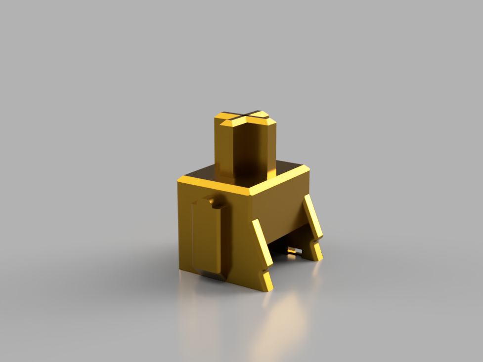

# KailhPro-ModKit
**Current version: V14**

  KailhPro-ModKit by <a xmlns:cc="http://creativecommons.org/ns#" href="https://github.com/PaulGameDev" property="cc:attributionName" rel="cc:attributionURL">Paul_GD</a> is licensed under a  <a rel="license" href="http://creativecommons.org/licenses/by-nc-sa/4.0/">Creative Commons Attribution-NonCommercial-ShareAlike 4.0 International License</a>. Based on a work at <a xmlns:dct="http://purl.org/dc/terms/" href="https://github.com/PaulGameDev/KailhPro-ModKit" rel="dct:source">https://github.com/PaulGameDev/KailhPro-ModKit</a>.

## What is this?
**This is a toolkit for Fusion360, attempting to make the "slider" part of the popular MX-style 3d-printable using FFF printers.**

Requirements: 
- 0.2mm Nozzle.
- Average experience with printing PETG.
- Patience to figure out the proper dimensions to achieve the needed tolerances for *your* printer.
- Autodesk Fusion 360.

### Why?
**Good tactile switches are expensive. Let's try changing that.**

The pre-configured slider was designed to be printed on an Original Prusa i3 MK3S using a 0.2mm nozzle, in PETG. The reference model was the slider from a Kailh Pro Purple switch, which already supplies some tactility. But we want more! So let's add more.

### Features
- Fully parametric design.
- Designed for FDM printing in mind.
- Nice, mid-heavy tactile bump.
- Really cheap price.

### Future Plans
**Why PETG? What about friction? Isn't this scratchy?**

Yes, this slider isn't silky smooth like good injection molded ones. *yet*.
PETG is an easily available filament, that can be recycled. Except for the friction coefficient, it has the right material properties to qualify for this project, and I hope that with enough lube it can become a usable replacement for expensive tactile switches.

The next goal I set is printing the sliders in POM filament, progress updates will be shown here once progress is made.

 
